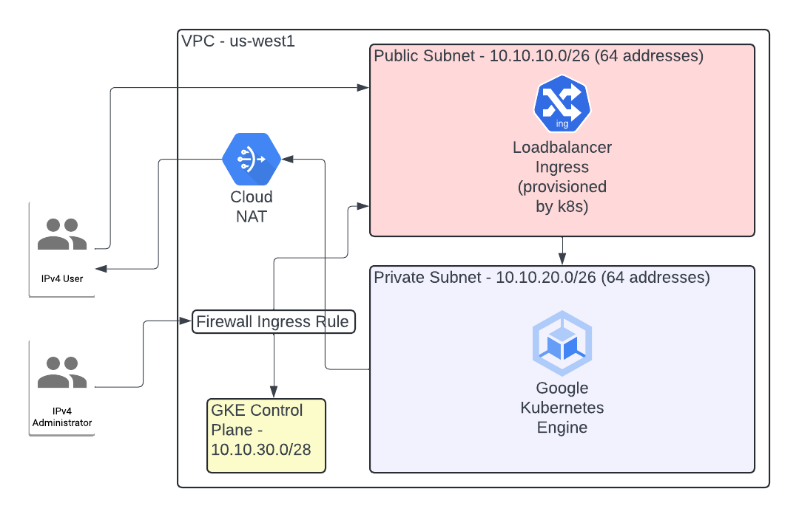
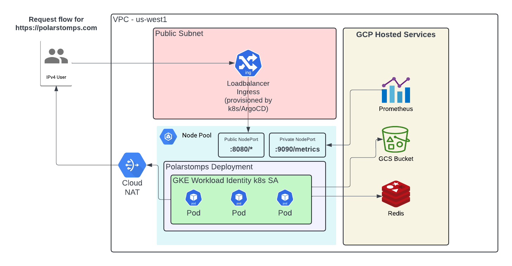

# About

This Terraform/Terragrunt repository contains the infrastructure-as-code necessary to build out a very simple, reference GCP architecture that supports a rudimentary web application.

## Modules

There are two modules that underpin everything.

### Environment Terraform Module

The environment module exists here in its own repository: https://github.com/howdoicomputer/tf-polarstomps-gcp-environment

The responsibility of this module is to create the base layer of infrastructure that constitutes a logical environment.

This includes:

* A VPC with a public and private subnet
* A VPC route that allows egress to the Internet
* Firewall rules to enable ingress from a "home" IP address
* A [Cloud Router](https://cloud.google.com/network-connectivity/docs/router/concepts/overview) and a [Cloud Nat](https://cloud.google.com/nat/docs/overview) in order to enable routing to a private GKE cluster
* A GKE/Kubernetes autopilot cluster that has private nodes and a public control plane endpoint (that is locked down to that same "home" IP address)
* And a polarstomps-webapp that lives in the `modules/` directory

The network layout that the environment module creates looks a little like this:



### Polarstomps Webapp Terraform Module

Any infrastructure ancillary to the web application itself is separated out into its own module.

This includes:

* An external IPv4 address
* An A record within the polarstomps zone.
* A hosted Memorystore Redis instance
* A k8s configmap with the Redis instance connection details
* A k8s secret that contains the Redis instance auth string
* The polarstomps k8s namespace (ArgoCD references this later on)
* A GCS bucket with a dummy file (`foobar.txt`)
* A policy bound to the GCS bucket that allows a k8s service account to access it through GKE workload identity federation
* A k8s service account

The architectural layout for Polarstomps looks like this:



# Getting started

## Dependencies

* Terraform
* Terragrunt
* ArgoCD CLI
* kubectl
* gcloud CLI
* A GCP account with a project pre-provisioned
* A Terraform cloud account with workspaces setup for each environment and webapp environment pairing

### Account Dependencies

This repo requires a GCP account to target and assumes that you have one. You'll need to create a `polarstomps` project and then put its project ID in `root.tfvars`.

This repo also uses Terraform Cloud. This part is a bit trickier to setup as the Terraform Cloud backend configuration exists in each `terragrunt.hcl` file and you'll need to edit those to point to your Terraform Cloud configuration (project and workspaces).

Example:

``` terraform
generate "remote_state" {
  path      = "backend.tf"
  if_exists = "overwrite_terragrunt"
  contents = <<EOF
provider "google" {
  region  = "us-west1"
}

terraform {
  backend "remote" {
    hostname     = "app.terraform.io"
    organization = "polarstomps" <- change

    workspaces {
      name = "infra-prod" <- change
    }
  }
}
EOF
}
```

### Access

Terraform will create a firewall rule and a whitelist entry for the k8s control plane that allows one IP address access to the public subnet and the plane endpoint.

You'll need to put yours into `root.tfvars` if you want to access anything.

### Domain

The domain for this app was purchased manually through Google (which provisioned the DNS zone automatically). You'll need to purchase your own domain and plug it into two places:

* The certificates manifest for Polarstomps (so that it can generate a cert for the domain)
* You'll also need to change the `dns_zone_name` in a webapp environment pairing terragrunt configuration file

## Deploying Environments

Environments are separated out into their own directories. To deploy a specific environemnt, cd into it and run `terragrunt init` followed by `terragrunt apply`.

To deploy the base environment:

``` sh
cd infra-dev/
terragrunt init
terragrunt apply
```

### Deploying ArgoCD

Since ArgoCD is used for deployments we need to actually set the thing up.

There is a Makefile in every environment directory that has some convenient directives to run:

```
cd infra-dev/

# Generate ~/.kube/config for deployed cluster
#
make auth-gke

# Deploy ArgoCD
#
make bootstrap-argo
```

## Deploying Webapp Infrastructure

In order to deploy the infrastructure for the web application after the environment has been created then cd into the webapp directory that matches the environment and run the following:

``` sh
cd polarstomps-webapp/polarstomps-webapp-dev
terragrunt init
terragrunt apply
```

### Deploying Polarstomps

The manifests for deploying Polarstomps is [here](https://github.com/howdoicomputer/polarstomps-argo-gcp).

The application manifests use a branch based approach for deploying to specific environemnts. That is:

The dev branch matches to the dev environment.
The prod branch matches to the prod environment.

So to deploy the production version Polarstomps:

``` sh
git clone https://github.com/howdoicomputer/polarstomps-argo-gcp
cd polarstomps-argo-gcp
git checkout prod
make deploy
make sync
```

## Logging and Metrics

Polarstomps manifests creates two separate NodePorts (:8080 and :9090). The Polarstomps application itself serves external routes on :8080 and internal routes on :9090 (/metrics and /healthz). The :8080 port is used by the ingress and the :9090 port is hidden from the world and used by the PodMonitoring resource.

The healthpoint endpoint is used for healthchecks to confirm that pods are healthy before they are put behind a loadbalancer.

The metrics endpoint serves Prometheus metrics.

Logs coming out of Polarstomps are *structured* (using the `log/slog`).

---
